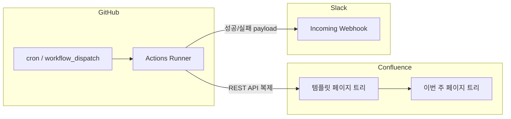

---

# 🗓️ GitHub Workflow Actions 으로 생산성 높이기

매주 직접 팀 위클리 미팅 페이지를 복제하고 링크를 슬랙에 올리는 건 단순한 작업이지만, 생각보다 귀찮은 일이기도 해요. "매주 위클리 미팅 노트를 생성하고 슬랙으로 공유하는 반복 작업을 자동화 할 수 없을까?" 라는 생각이 들었어요.

이번 포스팅에서는 **GitHub Actions**로 스케줄을 돌리고, **Confluence REST API**로 템플릿 페이지 트리를 복제한 다음, **Slack Incoming Webhook**으로 성공 시 링크·실패 시 에러 메시지를 팀 채널에 보내는 흐름을 정리해볼게요.

---

## GitHub Actions로 Confluence 위클리 노트 자동화

정리하면 이렇게 동작해요.

- 스케줄링된 (즉, 정의된) 요일·시간에 **위클리 문서가 자동으로 생성**된다.
- **성공**하면 Slack에 **만들어진 페이지 링크**가 온다.
- **실패**해도 Slack에 **에러 요약**이 온다 (CI만 빨간색이고 팀은 모르는 상황을 줄인다).
- **`workflow_dispatch`**로 수동 실행도 할 수 있어서, 배포 전에 한 번 돌려보기 좋다.



- **GitHub**: 스크립트 실행, Secrets 보관, cron으로 주기 실행
- **Confluence**: Atlassian 이메일 + API Token으로 Basic 인증 후 콘텐츠 API 호출
- **Slack**: Webhook URL로 채널에 메시지 전송

---

## GitHub Action 으로 워크플로 스케줄링

스케줄은 **cron**으로 설정해요. GitHub Actions의 cron은 **UTC 기준**이라, 한국 시간(KST)으로 맞출 때는 +9시간을 머릿속에 두고 조정하면 돼요.

아래 예시는 **매주 수요일 UTC 00:30**, 즉 **한국 시간 수요일 09:30**에 스케줄링 Job이 실행되도록 설정한 내용이에요.

```yaml
name: Weekly Confluence Page Clone

on:
  schedule:
    - cron: "30 0 * * 3"
  workflow_dispatch:

jobs:
  clone:
    runs-on: ubuntu-latest
    steps:
      - uses: actions/checkout@v4
      - uses: actions/setup-node@v4
        with:
          node-version: "22"
      - name: Install dependencies
        working-directory: scripts
        run: npm install
      - name: Run Confluence clone script
        working-directory: scripts
        run: node confluenceWeeklyClone.js
        env:
          CONFLUENCE_EMAIL: ${{ secrets.CONFLUENCE_EMAIL }}
          CONFLUENCE_TOKEN: ${{ secrets.CONFLUENCE_TOKEN }}
          SLACK_WEBHOOK_URL: ${{ secrets.SLACK_WEBHOOK_URL }}
```

### 참고: 로컬에서 미리 검증하기 · Node 맞추기 · Actions에서 수동 실행

**로컬에서 CI와 같은 일을 먼저 돌려보기**  
CI 에서는 Github Secrets 에 설정된 값을 참조하여 실행되지만, 로컬에서는 이 값들을 `.env`에 넣어 미리 테스트 할 수 있어요. (`CONFLUENCE_EMAIL`, `CONFLUENCE_TOKEN`, `SLACK_WEBHOOK_URL`). 이렇게 하면 실제로 워크플로를 올리기 전에 스크립트·API 권한·Webhook까지 한 번에 확인할 수 있어요.

**Node 버전은 CI와 맞추기**  
위 예시는 `setup-node`에서 **Node 22**를 쓰고 있고, 스크립트 주석도 Node 22 기준이에요. 로컬도 **같은 메이저(22)**를 쓰면 문법·`fetch` 등 런타임 차이로 “로컬에서는 되는데 Actions에서만 깨지는” 상황을 줄일 수 있어요. 팀과 맞추려면 `scripts/package.json`에 `"engines": { "node": ">=22" }` 정도를 두고, `nvm` / `fnm` 등으로 버전을 고정해 두는 것도 도움이 돼요.

**GitHub에서 워크플로 수동 실행 (`workflow_dispatch`)**  
저장소 **Actions** 탭에서 워크플로 이름(**Weekly Confluence Page Clone**)을 선택하여 **Run workflow** 로 워크플로를 실행하면, cron으로 스케줄링된 시간과 별개로 바로 한 번 수동으로 실행돼요. 시크릿·권한·최근 수정분이 main에 합치기 전에 잘 도는지 확인할 때 쓰기 좋아요.

---

## 그래서 Confluence 페이지를 자동 복제는 어떻게 하죠?

팀마다 템플릿 구조가 다르니 구현은 자유지만, Conflunce template page의 복제 과정을 구현한 `confluenceWeeklyClone.js`는 아래의 과정을 거치게 돼요.

```javascript
/**
 * Confluence 페이지 자동 복제 스크립트 (Node.js 22)
 * - 템플릿 페이지와 하위 페이지를 재귀적으로 복제
 * - 타이틀에 이번 주 목요일 날짜 자동 삽입
 * - 완료 후 Slack 알림 전송
 * - 로컬: .env 파일로 환경변수 관리
 * - GitHub Actions: Secrets로 환경변수 주입
 */

require("dotenv").config();

// =====================================================================
// 환경변수 (민감 정보) — .env 파일 또는 GitHub Secrets에서 주입
// =====================================================================
const EMAIL = process.env.CONFLUENCE_EMAIL; // Atlassian 계정 이메일
const API_TOKEN = process.env.CONFLUENCE_TOKEN; // Atlassian API Token
const SLACK_WEBHOOK_URL = process.env.SLACK_WEBHOOK_URL; // Slack Incoming Webhook URL

// =====================================================================
// 설정값 (비즈니스 로직) — 여기서 직접 수정
// =====================================================================

// Confluence 인스턴스 URL (끝에 / 없이)
const CONFLUENCE_BASE_URL = "your_page_url";

// 복사할 템플릿 페이지 ID
// 👉 찾는 법: 템플릿 페이지를 열고 URL 마지막 숫자
//    예: .../pages/5389419114/weekly+template → 5389419114
const TEMPLATE_PAGE_ID = "template_page_Id";

// 새로 생성된 페이지가 위치할 부모 페이지 ID
// 👉 찾는 법: 생성될 위치로 쓸 페이지를 열고 URL 마지막 숫자
//    예: .../pages/1234567890 → 1234567890
const PARENT_PAGE_ID = "parent_page_id";

// Confluence Space Key
// 👉 찾는 법: Space 메인 페이지 URL에서 /spaces/ 뒤의 값
//    예: .../spaces/TEAM/... → TEAM
const SPACE_KEY = "TEAM";

// =====================================================================

// Basic Auth 헤더값 생성
const authHeader = "Basic " + Buffer.from(`${EMAIL}:${API_TOKEN}`).toString("base64");
const headers = {
  "Content-Type": "application/json",
  Accept: "application/json",
  Authorization: authHeader,
};

/**
 * 이번 주 목요일 날짜 반환 (YYYY-MM-DD)
 */
function getThisThursday() {
  const today = new Date();
  const day = today.getDay(); // 0=일, 1=월, 2=화, 3=수, 4=목
  const daysUntilThursday = (4 - day + 7) % 7;
  const thursday = new Date(today);
  thursday.setDate(today.getDate() + daysUntilThursday);

  const y = thursday.getFullYear();
  const m = String(thursday.getMonth() + 1).padStart(2, "0");
  const d = String(thursday.getDate()).padStart(2, "0");
  return `${y}-${m}-${d}`;
}

/**
 * 페이지 정보 및 본문 조회
 */
async function getPage(pageId) {
  const url = `${CONFLUENCE_BASE_URL}/rest/api/content/${pageId}?expand=body.storage`;
  const res = await fetch(url, { headers });
  if (!res.ok) throw new Error(`getPage 실패 [${pageId}]: ${res.status} ${await res.text()}`);
  return res.json();
}

/**
 * 하위 페이지 목록 조회
 */
async function getChildren(pageId) {
  const url = `${CONFLUENCE_BASE_URL}/rest/api/content/${pageId}/child/page?limit=50`;
  const res = await fetch(url, { headers });
  if (!res.ok) throw new Error(`getChildren 실패 [${pageId}]: ${res.status} ${await res.text()}`);
  const data = await res.json();
  return data.results ?? [];
}

/**
 * 타이틀 생성
 * - parent page: 날짜만 사용 (e.g. "2025-03-20")
 * - child page: 기존 타이틀 + 날짜 (e.g. "홍길동 2025-03-20")
 */
function buildNewTitle(title, thursdayDate, isParent = false) {
  if (isParent) return thursdayDate;
  return `${title} ${thursdayDate}`;
}

/**
 * 새 페이지 생성 후 생성된 페이지 ID 반환
 */
async function createPage(title, body, parentId) {
  const url = `${CONFLUENCE_BASE_URL}/rest/api/content`;
  const payload = {
    type: "page",
    title,
    space: { key: SPACE_KEY },
    ancestors: [{ id: parentId }],
    body: {
      storage: { value: body, representation: "storage" },
    },
  };

  const res = await fetch(url, {
    method: "POST",
    headers,
    body: JSON.stringify(payload),
  });
  if (!res.ok) throw new Error(`createPage 실패 [${title}]: ${res.status} ${await res.text()}`);

  const created = await res.json();
  console.log(`  ✅ 생성됨: [${created.title}] (ID: ${created.id})`);
  return created.id;
}

function sleep(ms) {
  return new Promise((resolve) => setTimeout(resolve, ms));
}

/**
 * 페이지 본문 내 children 제목 참조를 새 제목으로 교체
 * (Include Page 매크로 등이 ri:content-title 로 페이지를 참조하는 경우 대응)
 */
function replaceChildTitlesInBody(body, titleMap) {
  let updatedBody = body;
  for (const [oldTitle, newTitle] of Object.entries(titleMap)) {
    // ri:content-title="Kate" 형태의 매크로 참조 교체
    updatedBody = updatedBody.replaceAll(`ri:content-title="${oldTitle}"`, `ri:content-title="${newTitle}"`);
  }
  return updatedBody;
}

/**
 * 페이지 본문 업데이트 (version 증가 필요)
 */
async function updatePage(pageId, title, body) {
  // 현재 버전 조회
  const url = `${CONFLUENCE_BASE_URL}/rest/api/content/${pageId}?expand=version`;
  const res = await fetch(url, { headers });
  if (!res.ok) throw new Error(`버전 조회 실패 [${pageId}]: ${res.status}`);
  const current = await res.json();
  const nextVersion = current.version.number + 1;

  // 본문 업데이트
  const updateUrl = `${CONFLUENCE_BASE_URL}/rest/api/content/${pageId}`;
  const payload = {
    type: "page",
    title,
    version: { number: nextVersion },
    body: {
      storage: { value: body, representation: "storage" },
    },
  };

  const updateRes = await fetch(updateUrl, {
    method: "PUT",
    headers,
    body: JSON.stringify(payload),
  });
  if (!updateRes.ok) throw new Error(`updatePage 실패 [${title}]: ${updateRes.status} ${await updateRes.text()}`);
  console.log(`  🔄 업데이트됨: [${title}]`);
}

/**
 * 소스 페이지와 모든 하위 페이지를 재귀적으로 복제
 */
async function clonePageTree(sourcePageId, parentId, thursdayDate, depth = 0, createdPages = []) {
  const indent = "  ".repeat(depth);
  const page = await getPage(sourcePageId);
  const originalTitle = page.title;
  const body = page.body.storage.value;

  const isParent = depth === 0;
  const newTitle = buildNewTitle(originalTitle, thursdayDate, isParent);
  console.log(`${indent}📄 복제 중: '${originalTitle}' → '${newTitle}'`);

  const newPageId = await createPage(newTitle, body, parentId);
  createdPages.push({ id: newPageId, title: newTitle });

  // Atlassian 서버가 새 페이지를 인덱싱할 충분한 시간 확보 (500 에러 방지)
  await sleep(3000);

  // 하위 페이지 재귀 복제
  const children = await getChildren(sourcePageId);
  const titleMap = {}; // { 원본 children 제목: 새 children 제목 }
  for (const child of children) {
    const childPage = await getPage(child.id);
    const newChildTitle = buildNewTitle(childPage.title, thursdayDate);
    titleMap[childPage.title] = newChildTitle;
    await clonePageTree(child.id, newPageId, thursdayDate, depth + 1, createdPages);
  }

  // children 제목이 변경된 경우 parent 본문의 매크로 참조도 업데이트
  if (Object.keys(titleMap).length > 0) {
    const updatedBody = replaceChildTitlesInBody(body, titleMap);
    if (updatedBody !== body) {
      console.log(`${indent}🔄 parent 본문 매크로 참조 업데이트 중: '${newTitle}'`);
      await sleep(1500);
      await updatePage(newPageId, newTitle, updatedBody);
    }
  }
}

/**
 * Slack으로 알림 전송
 */
async function sendSlackNotification({ thursdayDate, createdPages, errorMessage }) {
  if (!SLACK_WEBHOOK_URL) {
    console.log("⚠️  SLACK_WEBHOOK_URL 미설정 — Slack 알림 생략");
    return;
  }

  const isSuccess = !errorMessage;
  const pageLink = (p) => `<${CONFLUENCE_BASE_URL}/spaces/${SPACE_KEY}/pages/${p.id}|${p.title}>`;

  const parentPage = createdPages[0];
  const childPages = createdPages.slice(1);

  const successBlocks = [
    {
      type: "section",
      text: {
        type: "mrkdwn",
        text: [
          "이번주 팀 위클리 미팅 노트 공유 드립니다.",
          parentPage ? pageLink(parentPage) : "",
          childPages.length > 0 ? childPages.map((p) => `• ${pageLink(p)}`).join("\n") : "",
        ]
          .filter(Boolean)
          .join("\n"),
      },
    },
  ];

  const failureBlocks = [
    {
      type: "header",
      text: {
        type: "plain_text",
        text: "❌ Weekly Confluence 페이지 생성 실패",
      },
    },
    {
      type: "section",
      fields: [
        { type: "mrkdwn", text: `*날짜*\n${thursdayDate}` },
        { type: "mrkdwn", text: `*Space*\n${SPACE_KEY}` },
      ],
    },
    {
      type: "section",
      text: {
        type: "mrkdwn",
        text: `*오류 내용*\n\`\`\`${errorMessage}\`\`\``,
      },
    },
  ];

  const payload = {
    blocks: isSuccess ? successBlocks : failureBlocks,
  };

  const res = await fetch(SLACK_WEBHOOK_URL, {
    method: "POST",
    headers: { "Content-Type": "application/json" },
    body: JSON.stringify(payload),
  });

  if (!res.ok) {
    console.error(`⚠️  Slack 알림 전송 실패: ${res.status}`);
  } else {
    console.log("📨 Slack 알림 전송 완료");
  }
}

async function main() {
  const thursdayDate = getThisThursday();
  const createdPages = [];

  console.log("=".repeat(50));
  console.log(`🗓️  이번 주 목요일: ${thursdayDate}`);
  console.log(`📄 템플릿 페이지 ID : ${TEMPLATE_PAGE_ID}`);
  console.log(`📁 생성 위치 (parent): ${PARENT_PAGE_ID}`);
  console.log(`🌐 Space: ${SPACE_KEY}`);
  console.log("=".repeat(50));

  try {
    await clonePageTree(TEMPLATE_PAGE_ID, PARENT_PAGE_ID, thursdayDate, 0, createdPages);
    console.log("=".repeat(50));
    console.log("🎉 완료!");
    await sendSlackNotification({ thursdayDate, createdPages });
  } catch (err) {
    console.error("❌ 오류 발생:", err.message);
    await sendSlackNotification({
      thursdayDate,
      createdPages,
      errorMessage: err.message,
    });
    process.exit(1);
  }
}

main();
```

1. **이번 주 기준 날짜**를 잡는다. (위클리가 목요일이면 그 주 목요일을 `YYYY-MM-DD`로)
2. **템플릿 페이지**를 읽고, **하위 페이지**를 재귀적으로 따라가면서 같은 모양의 **새 페이지 트리**를 만든다.
3. 제목 규칙은 팀 규칙에 맞게. (예: 부모는 날짜만, 자식은 `기존 제목 + 날짜`)
4. 본문에 Include Page 같은 걸로 **자식(sub page) 제목을 참조**하는 매크로가 있으면, 복제 후 제목이 변경되므로 **`ri:content-title`을 새 제목으로 바꾼 뒤** 본문(parent page)을 한 번 더 업데이트한다.
5. API 부하·인덱싱 타이밍 때문에 가끔 본문(parent page)의 indexing 에 실패하여 자식(sub/children) 페이지 생성에 실패하는 경우를 방지하고자, 페이지 복제 사이사이에 **짧은 sleep**을 넣어요.

인증은 Atlassian **API Token** + 계정 이메일로 **Basic Auth**를 만들어서 `fetch`로 호출하는 방식이 단순해요. 로컬은 `dotenv`로 `.env`를 읽고, CI에서는 워크플로 `env`에 같은 이름으로 넣어 주면 같은 코드로 돌아가게 되어요.

---

## Slack 알림 연동하기

**Incoming Webhook** URL을 GitHub Secrets에 넣고, 스크립트 마지막에 `fetch(POST)`로 Block Kit 형태 JSON을 보내요.

- **성공**: 부모 페이지 링크 + 자식 페이지들의 링크를 포함하여 슬랙 메시지 전송
- **실패**: 헤더 + 날짜·Space 같은 맥락 + (필요 시) **에러 메시지를 코드 블록**으로 슬랙 메시지 전송
- Webhook이 없으면 **슬랙 알림 전송 구문만 스킵**하고 스크립트는 그대로 돌게 해 두면, 로컬에서 돌릴 때 편해요.

이렇게 해 두면 실패했을 때도 슬랙에서 **바로 어떤 에러였는지** 볼 수 있어서 운영이 한결 편해집니다.

---

## GitHub Secrets에 넣을 값

| Secret              | 설명                                                                               |
| ------------------- | ---------------------------------------------------------------------------------- |
| `CONFLUENCE_EMAIL`  | Atlassian 계정 이메일                                                              |
| `CONFLUENCE_TOKEN`  | [Atlassian API Token](https://id.atlassian.com/manage-profile/security/api-tokens) |
| `SLACK_WEBHOOK_URL` | Slack App의 Incoming Webhook                                                       |

`.env`는 **origin rep에 커밋하지 말고** `.gitignore`에 넣어 두는 걸 추천해요.

---

## 운영할 때 한 번씩 생각해 볼 것

- Cron은 **분 단위**이고, Actions가 **조금 늦게** 도는 일도 있어요. “정각에 반드시”가 중요하면 다른 스케줄러도 같이 보는 게 좋아요.
- API Token은 **계정 권한을 그대로** 타니까, 권한 최소화랑 주기적 교체는 습관으로 두면 좋고요.
- 템플릿·부모 페이지가 바뀌면 페이지 ID, Space Key 등은 스크립트 상단 설정으로 관리해 두면 **PR로 변경 이력**도 남기기 쉬워요.
- README랑 워크플로에 **스케줄 시각(KST / UTC)** 설명이 엇갈리면 나중에 헷갈리니, 한쪽 기준으로 맞춰 두면 좋습니다.

---

## Summary

| 구분          | 내용                                                                                     |
| ------------- | ---------------------------------------------------------------------------------------- |
| 스케줄        | GitHub Actions `schedule` (cron, **UTC**) + 필요 시 `workflow_dispatch`                  |
| Confluence    | REST API로 템플릿 트리 복제, Basic Auth (이메일 + API Token)                             |
| Slack         | Incoming Webhook, 성공 시 링크 / 실패 시 에러 텍스트                                     |
| 코드 위치     | `scripts/confluenceWeeklyClone.js`, 워크플로는 `.github/workflows/weekly-confluence.yml` |
| 확장 아이디어 | 주간 리포트, 릴리즈 노트 초안, 이슈 템플릿 복제 등 같은 패턴으로                         |

---

### 마무리

반복 작업 하나를 **스케줄 + API + 알림**으로 묶어 두면, “이번 주 노트 만들었어?”나 “링크 어디 있지?” 같은 소통 비용이 꽤 줄어요. 특히 실패했을 때도 같은 채널로 에러가 오면, 팀이 같이 빨리 알아채기 좋습니다.

비슷한 자동화를 이미 해보셨거나, Confluence 쪽에서 더 깔끔하게 처리하는 팁이 있으면 댓글로 공유해 주세요.

---
